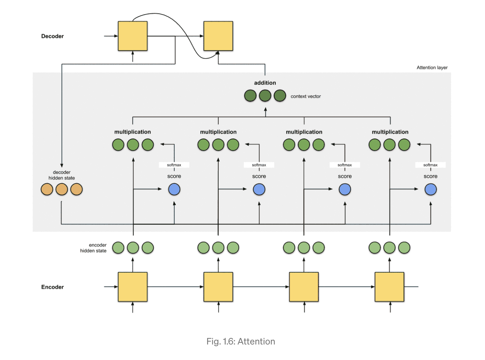

# Overview

 Seq2Seq 모델은 전체 input을 살펴본 다음 context vector에 정보를 압축해서 전달하기 때문에 전체적인 맥락을 파악하는 데에 있어서 효과적이다. 하지만 입력 문장이 너무 길어지게 되면 시퀀스를 압축하는 과정에 있어서 정보가 소실되고, 효율적으로 학습을 하지 못한다는 한계를 가지고 있다. 이러한 문제를 해결하기 위해 등장한 개념이 **Attention Mechanism**이다. 

 기존의 Seq2Seq 모델에서는 인코더의 고정된 context vector가 디코더로 전달된다면 Attention이 추가한 방법은 hidden state의 값을 통해 attention score를 계산하고 디코더의 각 시퀀스 스텝마다 계산된 attention을 입력으로 넣는다. 따라서 디코더의 각 시퀀스 스텝마다 attention의 가중치는 다르게 적용된다. 

  Attention의 아키텍처는 다음과 같으며, 구현 단계는 아래와 같이 4 steps으로 이루어져 있다.   

* Step 0: Prepare hidden states.
* Step 1: Obtain a score for every encoder hidden state.
* Step 2: Run all the scores through a softmax layer.
* Step 3: Multiply each encoder hidden state by its softmaxed score.
* Step 4: Sum up the alignment vectors. 

 각 단계별 상세한 내용은 아래의 포스트를 참고하면 된다. 



