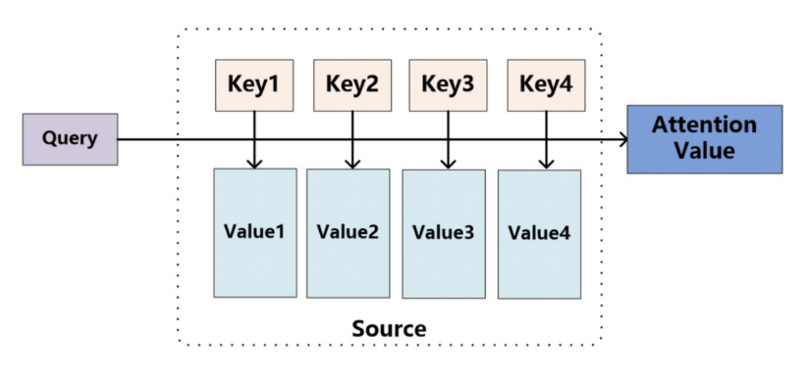

# Attention Function

 Attention function은 주어진 Query에 대하여 모든 Keys와의 유사도를 각각 구한다. 그리고 구한 유사도 결과를 Key와 mapping 되어 있는 각각의 Value에 반영해준다. 그리고 유사도가 반영된 Value를 모두 더하여서 리턴해주는데, 이를 Attention Value라고 한다. 

**Attention\(Q, K, V\) = Attention Value**

* Q = Query \(t 시점의 디코더 셀에서의 hidden state\)
* K = Keys \(모든 시점의 인코더 셀의 hidden states\)
* V = Values \(모든 시점의 인코더 셀의 hidden states\)

