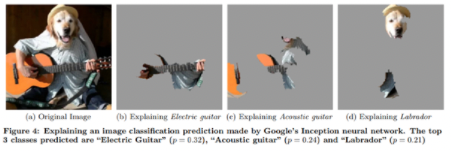
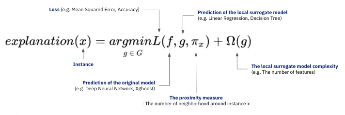

# LIME(Local Interpretable Model-agnostic Explanations)

로컬 대리 분석은 ‘LIME(Local Interpretable Model-agnostic Explanations)’ 이라는 이름으로 더 잘 알려져 있다. 국소적(local)으로는 비교적 간단한 모델(기능 상 surrogate model)로 근사시킬 수 있으면, 국소적인 해석(local interpretation)으로 설명도 할 수 있다.&#x20;

이 방법론의 컨셉은 ‘모델 전체를 설명하려고 하지 않고, 설명하고자 하는 관측값을 정해서 그 주변을 잘 설명하는 대리모형을 만든다'라는 것이다.&#x20;

#### LIME 적용 사례 &#x20;

> Ribeiro, M. T., Singh, S., & Guestrin, C. (2016, August). " Why should i trust you?" Explaining the predictions of any classifier. In Proceedings of the 22nd ACM SIGKDD international conference on knowledge discovery and data mining (pp. 1135-1144).

#### LIME 원리&#x20;

특정 관측치 x에 대하여 가장 좋은 해석을 제공하는 Local Surrogate Model(g)를 찾는 과정에서 LIME은 두 가지 고려사항에 집중한다.  &#x20;

* 해석하고자 하는 기존 모델(f)과 유사하게 예측해야 한다.
* 사람이 해석할 수 있을 정도로 단순한 모델이어야 한다.

#### LIME 장점

* LIME은 블랙박스 모델에 관계없이 XAI를 적용할 수 있다. 입력 데이터를 기반으로 설명 가능성을 조사하기 때문에 모델의 종류에 구애받지 않는다.&#x20;
* LIME은 다른 XAI 기법과 비교했을 때 모형이 매우 가볍고, 결과가 직관적이다.&#x20;
* LIME은 매트릭스로 표현 가능한 데이터(tabular data, text and image)에 대해 모두 작동하는 흔치 않은 기법이다.

#### LIME 단점

* 데이터의 분포가 국소(local)적으로도 매우 비선형적이면 local에서 선형성을 가정하는 LIME은 설명력에 한계를 갖게 된다.&#x20;
* The proximity measure와 model의 complexity를 설정하는 데에 명확한 기준이 없기 때문에 모호하다.&#x20;
* LIME은 데이터 하나에 대한 설명이기 때문에 모델 전체에 대한 일관성을 보장하지 못한다.


LIME 예제

