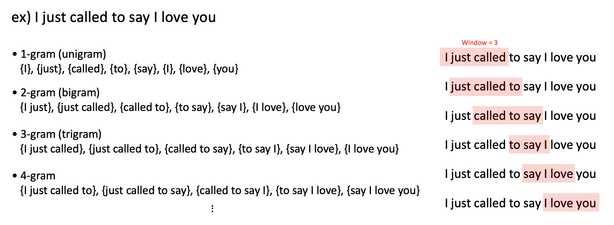
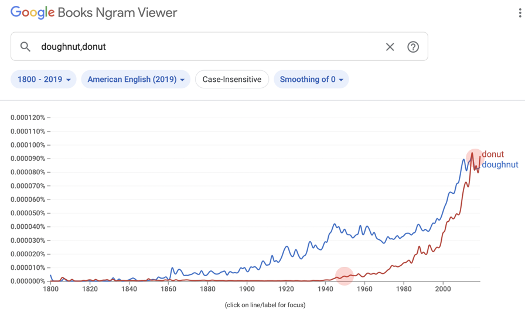

# N-gram language model

N-gram은 N개의 문자열 크기만큼의 window를 만들어 왼쪽에서 오른쪽으로 한 단위씩 움직이며 추출되는 시퀀스의 집합을 기록하는 것이다. 이때 N은 얼마만큼의 단위로 잘라낼지를 나타내는 지표이다. N이 1이면 unigram, 2이면 bigram, 3이면 trigram이라 부르고, N 값은 더 커질 수 있다.

문장에서 N-gram을 생성할 때, 어떤 단위로 잘라내는지에 따라서 word level과 character level로 나뉜다. word level의 N-gram을 사용하면 단어나 문구의 출현빈도를 파악하는 데에 용이하고, character level의 N-gram을 사용하면 misspelled words를 다루거나 Native language identification 등에 좀 더 효과적이다.

이러한 N-gram을 사용하는 대표적인 사례는 [구글 북스 엔그램\(Google Books N-gram\)](https://books.google.com/ngrams)이 있다. 구글이 모든 책들을 디지털화 시키면서 함께 진행한 프로젝트로, 모든 책들로부터 N-gram의 각 출현 빈도를 계산하여 그래프로 제공해준다. 책은 보통 그 시대의 이야기를 담고 있기 때문에, 이를 통해 이전엔 분석하기 어려웠던 문화의 전개 방향이나 당대의 관심사 등을 쉽게 파악할 수 있다.

예를 들면 'doughnut'으로 쓰이던 도넛의 철자를 'donut'으로 쓰기 시작한 게 '던킨도너츠Donuts'의 창립된 1950년대부터였다는 사실을 파악할 수 있다. 더불어 2014년부터 'doughnut'보다 'donut'의 쓰임이 더 많아진 것을 보면 '던킨도너츠'가 시대에 미친 영향력을 알 수 있다.

