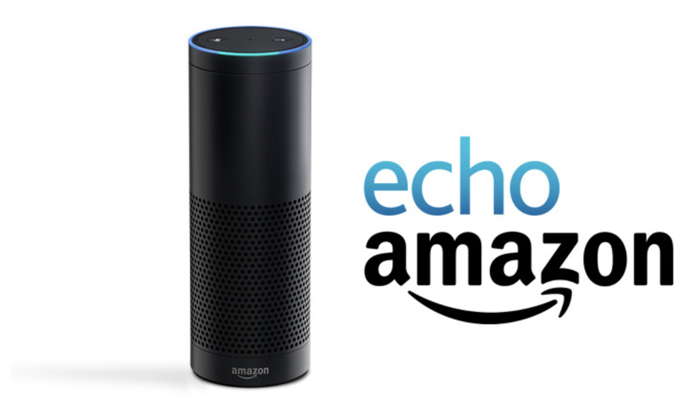
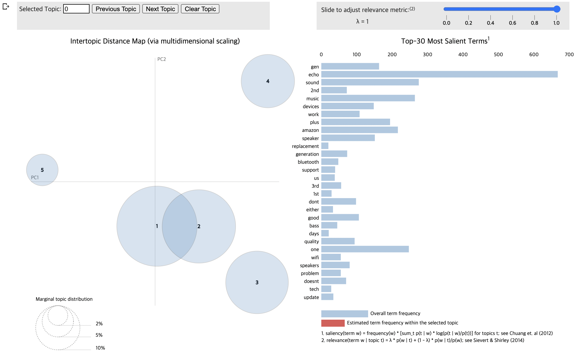

# Analysing Product Review Using Topic Modeling

 현재 글로벌 스마트 스피커 시장의 열기가 매우 뜨겁다. 스마트 스피커란 IoT 음성인식 AI assistant가 탑재된 기기 및 서비스를 말한다. 대표적인 제품으로는 Amazon Echo\(Alexa\), Apple HomePod\(Siri\), Google Home\(Ok google\) 등이 있다. 그 중 시장점유율이 가장 높은 'Amazon Echo'을 대상으로, 이를 구매한 구매자들의 리뷰 데이터를 사용해 LDA 토픽 모델을 생성하고 해당 상품에 대한 인식이나 이미지 등의 인사이트를 발굴해본다.



**1. 필요한 라이브러리 로드하기**

```python
import pandas as pd
import numpy as np
import re 
from collections import defaultdict # 기본값이 있는 딕셔너리 모듈
import gensim # LDA 모델을 시각화할 수 있는 라이브러리
from gensim import corpora # 토픽모델링을 위한 라이브러리
from gensim.models import LdaModel # LDA 모델 사용
from gensim.models.coherencemodel import CoherenceModel #모델 평가
import nltk
nltk.download('stopwords') #불용어 사전
from nltk.corpus import stopwords 
```

**2. 데이터 불러오기**

웹사이트 크롤링 서비스를 제공하는 [ScrapeHero](https://www.scrapehero.com/marketplace/)로부터 데이터를 수집하였다. 원하는 웹페이지의 url과 기타 조건들을 입력하면 별도의 코딩 없이 데이터를 획득할 수 있다. ScrapeHero에서는 아마존, 월마트, 인스타그램, 구글지도, 링크드인 등의 크롤링 서비스를 제공한다. 무료버전으로 25페이지까지 데이터를 수집할 수 있다.


```python
data_url = 'https://raw.githubusercontent.com/Sol-J/Study/master/data/Amazon_echo_review_data(250).csv' 
df = pd.read_csv(data_url, encoding='utf-8') 
df.head(10)
```

```python
reviews = list(np.array(df['review_text'].tolist())) #리뷰만 추출해서 데이터타입을 리스트로 변환
reviews
```

**3. 데이터 전처리**

```python
#문장 부호 제거
reviews = [re.sub(r'[^\w\s]','',str(item)) for item in reviews] #정규식 패턴과 일치하는 문자열을 substitution하는 메서드 

#불용어 제거
stopwords = set(stopwords.words('english')) 
texts = [[word for word in document.lower().split() if word not in stopwords] for document in reviews]

#{단어 : 빈도}의 딕셔너리 생성 
frequency = defaultdict(int) 
for text in texts:
    for token in text:
         frequency[token] += 1

#빈도가 2회 이상인 단어만 남김
texts = [[token for token in text if frequency[token] > 1] for text in texts]
```

LDA 토픽 모델을 생성하기 위해 필요한 두가지 입력값은 **{단어 : 단어 id}로 구성된 dictionary**와 **\(단어 id, 빈도\)로 구성된 corpus**이다. 다음의 코드를 통해 이들을 생성할 수 있다.

```python
dictionary = corpora.Dictionary(texts)
print(dictionary.token2id) #딕셔너리로부터 생성된 각 단어(token)별 고유 id를 확인할 수 있음
```

```python
corpus = [dictionary.doc2bow(text) for text in texts] #doc2bow 메서드는 각 단어들의 등장 횟수를 세고, 그 결과를 수치화된 벡터(정수 식별자)로 반환해줌
print(corpus) #단어ID별 빈도를 반환해줌
```

**4. LDA 토픽 모델 생성**

```python
NUM_TOPICS = 5
ldamodel = gensim.models.LdaModel(corpus, id2word=dictionary, num_topics = NUM_TOPICS, passes = 50)
```

```python
#각 토픽들의 주요 키워드와 각 키워드들의 기여도(가중치)확인
topics = ldamodel.show_topics()
for topic in topics:
    print(topic) 
```

```python
#결과를 데이터프레임으로 정리하기
word_dict = {};
for i in range(NUM_TOPICS):
    words = ldamodel.show_topic(i, topn = 30)
    word_dict['Topic{}'.format(i+1)] = [i[0] for i in words]
pd.DataFrame(word_dict)
```

```text
(0, '0.025*"sound" + 0.018*"music" + 0.016*"echo" + 0.013*"speaker" + 0.012*"alexa" + 0.009*"like" + 0.009*"one" + 0.008*"good" + 0.008*"im" + 0.007*"speakers"')
(1, '0.025*"echo" + 0.019*"alexa" + 0.017*"one" + 0.013*"music" + 0.011*"amazon" + 0.011*"play" + 0.008*"time" + 0.007*"turn" + 0.007*"home" + 0.007*"sound"')
(2, '0.023*"alexa" + 0.017*"echo" + 0.009*"app" + 0.009*"device" + 0.008*"would" + 0.008*"use" + 0.008*"amazon" + 0.007*"devices" + 0.007*"get" + 0.006*"like"')
(3, '0.013*"echo" + 0.011*"amazon" + 0.010*"replacement" + 0.010*"devices" + 0.010*"work" + 0.007*"dont" + 0.006*"bluetooth" + 0.006*"support" + 0.006*"us" + 0.006*"days"')
(4, '0.046*"echo" + 0.025*"gen" + 0.015*"plus" + 0.014*"sound" + 0.012*"2nd" + 0.011*"music" + 0.009*"generation" + 0.007*"3rd" + 0.006*"device" + 0.006*"alexa"')
```

위의 결과를 토대로 다음과 같이 토픽을 요약할 수 있다.

* 토픽 1 : 음향\(bass, volume, voice, speaker, audio\)에 관하여 긍정적인 언급\(like, good, well, much\)을 하고 있다. 
* 토픽 2 : 조명\(light, lights\) 제어와 관련해서 타사 제품인 '구글 홈'과 비교되고 있다. 
* 토픽 3 : 아마존에코 장치를 알렉사 앱에 연동하는 부분에서 wifi, music과 관련된 이슈가 있다. 
* 토픽 4 : 블루투스 연결 시 약간의 문제\(doesn't work, issues, problem 등\) 가 있다. 
* 토픽 5 : 구 세대\(ehco plus, ehco dot, 1st, 2nd\)와 신제품\(3rd, gen\)에 대한 비교\(better, great, also\)도 언급되고 있다. 

**5. 모델 평가**

```python
# UMass는 주제의 일관성을 평가하는 가장 빠른 지표이다. 
coherence_model_lda = CoherenceModel(model=ldamodel, texts=texts, dictionary=dictionary, coherence="u_mass") 
coherence_lda = coherence_model_lda.get_coherence() 
print('Coherence Score (u_mass): ', coherence_lda) #Coherence Score가 0에 가까울 수록 완벽한 일관성을 가진다는 의미이다.
```

**6. 토픽 시각**

pyLDAvis라는 라이브러리를 사용하여 토픽 모델링 결과를 시각화 할 수 있다. 결과 해석은 아래의 내용을 참고하면 된다.

* 좌측의 원들은 각각의 토픽들을 나타낸다. 각각의 토픽들을 2차원 공간에 축소하여 토픽 간의 관계를 살펴볼 수 있도록 한다.
* 원의 크기가 클 수록 좀 더 일반적인 토픽이라고 볼 수 있다.
* 원들 간의 거리는 각 토픽들이 서로 얼마나 다른지를 보여준다. 만약 두 개의 원이 겹친다면, 이 두개의 토픽은 유사한 토픽이라는 의미이다. 
* 따라서 좋은 토픽 모델은 하나의 사분면에서 전체적으로 골고루 흩어져있는 구조를 가진다. 
* 원을 하나 클릭하면, 우측에 단어와 막대그래프가 업데이트된다. 이 단어들은 해당 토픽을 형성하는 주요 키워드들을 의미한다. 
* λ 파라미터를 조절함으로써 각 토픽의 키워드들에 대한 순위\(rank\)를 조정할 수 있다. 토픽 별 타당한 키워드를 도출하기 위해서는 최적의  λ 값을 설정할 필요가 있다.
  * λ = 1인 경우 토픽 별로 가장 자주 등장하는 단어들을 우선적으로 키워드로 선택한다.
  * λ = 0인 경우 토픽 간에 차이가 많이 나타나는 차별적인 단어를 우선적으로 키워드로 선택한다. 토픽의 분별력을 높이는 데에 도움이 된다. 

```python
!pip install pyLDAvis==2.1.2 
import pyLDAvis.gensim
lda_display = pyLDAvis.gensim.prepare(ldamodel, corpus, dictionary)
pyLDAvis.display(lda_display)
```



