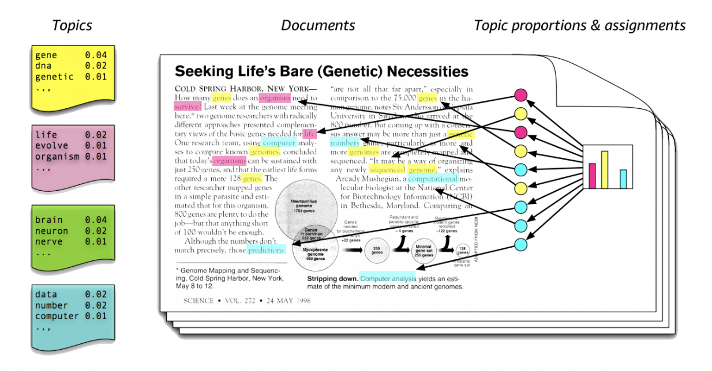

# Latent Dirichlet Allocation

토픽모델링 기법에는 LSA\(Latent Semantic Analysis\), PLSI\(Probabilistic Latent Semantic Indexing\), LDA\(Latent Dirichlet Allocation\) 등 다양하게 있는데, 이들 중 가장 범용적으로 사용되고 있는 알고리즘은 LDA이다.

LDA에서는 문서들은 토픽들의 혼합으로 구성되어 있고, 토픽들은 확률 분포에 기반하여 단어들을 생성한다고 가정한다. 따라서 데이터가 주어지면, LDA는 문서가 생성되는 과정을 확률모형으로 모델링 하며 역추적\(reverse engineering\)한다.

LDA의 개략적인 도식은 아래 그림과 같다.

* LDA는 **\(1\) 특정 토픽에 특정 단어가 나타날 확률**을 알려준다. 예를 들어 아래의 노란색 토픽에는 'gene', 'dna', 'genetic'이라는 단어가 각각 0.04, 0.02, 0.01의 확률로 등장한다. 따라서 이 노란색 토픽은 대략 '유전자'와 관련된 주제라는 것을 알 수 있다. 
* 또한 LDA는 **\(2\) 문서에 특정 토픽이 존재할 확률**을 알려준다. 오른쪽의 문서를 보면 전반적으로 빨간색, 파란색 토픽에 해당하는 단어보다 노란색 토픽에 속하는 단어들이 많이 분포한다. 따라서 이 문서는 '유전자'와 과련된 문서일 가능성이 크다.
* **\(1\)과 \(2\)의 확률을 결합 확률로 추정**하여 토픽을 추출한다.

LDA 수행 순서는 다음과 같다.

* 토픽 개수 K개 설정한다.
* 모든 단어에 랜덤하게 K개 중 하나의 토픽을 할당\(Allocation\)한다.
* 랜덤으로 할당된 값은 대부분 틀린 값인 경우가 많기 때문에, 모든 문서 및 모든 단어에 아래의 사항을 반복\(iterate\)하여 수렴상태로 통일되게 한다.
  * 특정 문서 내의 단어 w에 대하여 아래의 두가지 기준으로 토픽을 재할당 한다.

    * p\(topic t \| document d\) : 문서 d의 단어들 중 토픽 t에 해당하는 단어들의 비율
    * p\(word w \| topic t\) : 각 토픽들 t에서 해당 단어 w의 분포

**&lt;예시&gt;**

아래와 같이 3개의 문서가 있다고 가정한다.

* 문서1 : 나는 사과랑 바나나를 먹는다.
* 문서2 : 나는 귀여운 침팬치가 좋다.
* 문서3 : 활기차고 귀여운 침팬치가 바나나를 먹는다. 

그리고 주제는 2개가 있다고 가정하고, LDA로 토픽모델링을 수행하면 다음과 같은 결과가 산출된다.

* p\(topic t \| document d\) : 각 문서의 토픽 분포
  * 문서1 : 토픽A 100%
  * 문서2 : 토픽B 100%
  * 문서3 : 토픽B 60%, 토픽A 40%
* p\(word w \| topic t\) : 각 토픽의 단어 분포
  * 토픽A : 사과 20%, 바나나 40%, 먹는다 40%, 귀여운 0%, 침팬치 0%, 좋다 0%, 활기차고 0%
  * 토픽B : 사과 0%, 바나나 0%, 먹는다 0%, 귀여운 33%, 침팬치 33%, 좋다 16%, 활기차고 16%

