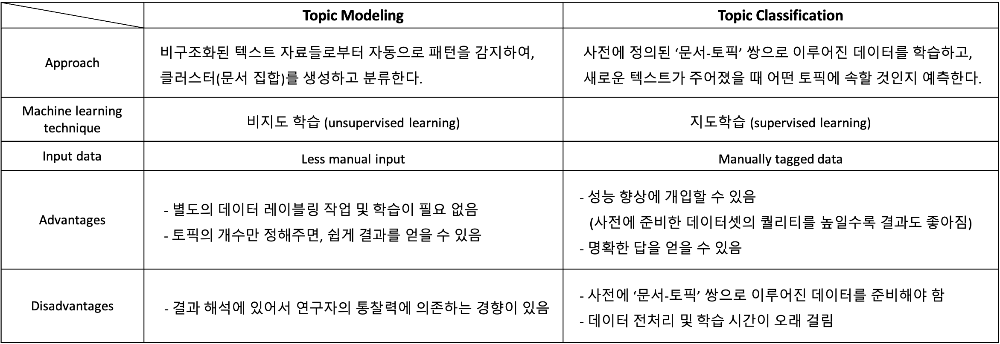

# Topic Modeling

토픽 모델링\(Topic Modeling\)이란 기계 학습 및 자연어 처리 분야에서 문서 집합의 추상적인 '주제'를 발견하기 위한 통계적 모델로, 광범위한 문서 내에서 잠재적인 의미 구조를 발견하기 위해 사용되는 프로세스를 말한다. 이때 토픽은 함께 등장할 확률이 높고 유사한 의미를 가지는 단어들의 집합이라고 할 수 있다.

주로 비정형 텍스트의 집합을 이해하기 쉽도록 정리하는 데에 쓰이고, 이외에도 이미지, 유전자 정보 등에서 유의미한 구조를 발견하는 데에 유용하게 사용되고 있다.

Topic Analysis Techniques는 대표적으로 Topic Modeling과 Topic Classification으로 나눌 수 있다. 각각의 접근법, 장단점 등은 다음 표와 같다.

