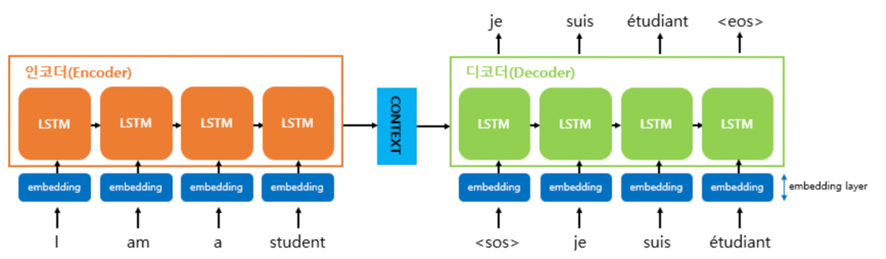
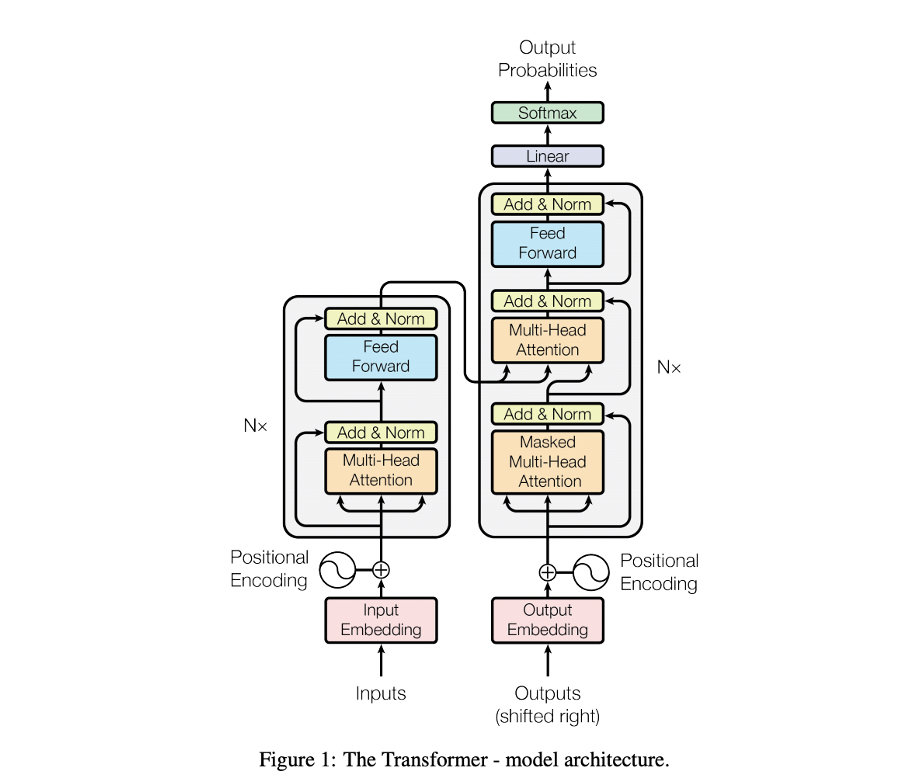

# Attention

 이어서 등장할 Transformer에 대해 이해하려면, **Sequence to Sequence \(Seq2Seq\)**을 알고있어야 한다. Seq2Seq는 2014년에 기계번역을 위해 등장한 모델로, '인코더-디코더' 라고도 불린다.  

 이전에 자연어처리에서 시퀀스의 흐름을 조정하기 위해 사용한 RNN은 출력이 바로 이전의 입력만 고려하기 때문에 정확도에 한계가 있었다. 즉 전체 문장을고려하지 않고 다음 단어를 생성해내기 때문이다. 따라서 이를 해결하기 위해 Seq2Seq가 등장하였다. Seq2Seq는 아래 그림과 같이 두개의 LSTM으로 구성된 모델이다. 인코더는 입력으로 들어온 sequential data를 압축해서 context vector로 표현해주고, 디코더는 압축된 context vector를 새로운 sequential data로 변환해준다. 

 이러한 Seq2Seq는 전체 input을 살펴본 다음, context vector에 정보를 압축해서 전달하기 때문에 전체적인 맥락을 파악하는 데에 있어서 효과적이었다. 하지만 결국 입력 문장이 너무 길어지면 시퀀스를 압축하는 과정에서 정보가 소실되고, 효율적으로 학습을 하지 못한다는 RNN 기반 모델의 고질적인 한계에 부딪히게 된다. 

 이와 같은 현상을 개선하기 위해 2017년에 RNN 없이 설계한 자연어처리 모델인 **Transformer**가 등장하게 된다. 기존에 자연어처리에서 시퀀스의 흐름을 조정하던 RNN 없이 설계 되었음에도 불구하고 RNN 보다 우수한 성능을 보인다는 것이 특징적이다. 대신 Transformer는 오직 어텐션\(Attention\)만을 사용하여 인코더-디코더를 구현하였다. 

 위 그림과 같이 인코더가 기존의 RNN으로 구성되는 게 아니라 CNN으로 Parallelize하게 구성되었다는 것이 큰 특징이다. 아키텍처를 살펴보면 크게 인코더와 디코더로 나뉘고, 각 6개의 인코딩 레이어와 6개의 디코딩 레이어로 구성되어 있다.  각각의 인코딩 레이어는 self-attention 계산을 통해 feed-forward를 거쳐 다음 레이어의 입력으로 보내게 되고, 이러한 방식으로 input에 대한 semantic하고 lexical한 정보를 모두 학습할 수 있게 된다. 그러고 나서 디코더에 넘겨주면 output이 어디에 해당하는지 align하고 generate하는 과정이 필요한데, 그 부분을 encoder-decoder attention layer가 수행한다. 

 즉 Transformer의 핵심은 Attention 개념을 이용하여 sequential computation 을 줄일 수 있고, 더 많은 부분을 병렬처리 하게 만들면서 동시에 더 많은 단어들 간의 dependency를 모델링 할 수 있다는 것이다. 

 현재 각종 벤치마크에서 좋은 성능을 내고 있는 모델들은  대부분 Transformer 기반의 Pretrained 모델이다. 그만큼 NLP 분야에서 강력한 영향을 미치고 있는 모델이다. Transformer에 대한 자세한 내용은 아래의 논문을 참고하면 된다.   



