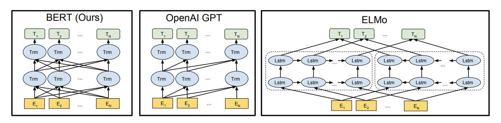
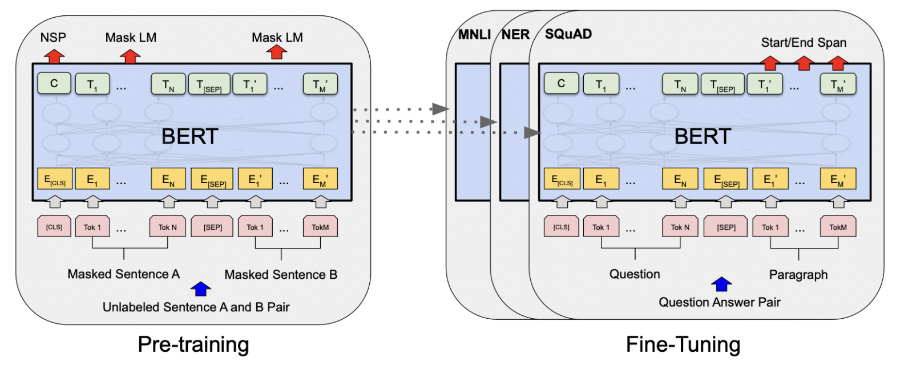

# Combining the above

 **Bidirectional Encoder Representations from Transformers \(BERT\)**는 2018년 11월 구글이 공개한 인공지능\(AI\) 언어 모델로, 일부 성능 평가에서 인간보다 더 높은 정확도를 보이며 자연어처리 분야에서 각광받고 있다. 이렇게 우수한 성능을 발휘할 수 있는 것은 BERT가 자연어 처리 태스크를 양방향으로 pre-training하는 시스템이기 때문이다.

 기존의 대부분의 언어 모델은 앞의 단어를 사용해 다음 단어를 예측하는 단방향성 또는 얕은 양방향성을 띄고 있다. GPT는 left-to-right의 단방향 아키텍처를 사용하며, 이는 각 토큰이 Transformer의 self-attention 계층에서 이전 토큰에만 참여할 수 있는 구조이다. ELMo의 경우 양방향을 띄고 있으나, 단방향과 역방향을 합친 것이기 때문에 완전한 양방향이라고 볼 수 없다. 

 하지만 언어의 문맥\(context\)은 실제로 양방향으로 존재하는 것이기 때문에 언어 모델의 학습도 양방향으로 이루어져야 한다. 이를 위해 등장한 것이 마스크 언어 모델 \(Masked Language Model\)이다. 이는 입력 텍스트의 일부 단어들을 마스킹\(masking\)해서 해당 단어를 모델이 알지 못하게 가린다. 그 후 모델을 통해 마스킹된 단어가 무엇인지 예측하도록 하는 방식이다. 이로써 앞뒤 상관없이 문장 안의 단어들을 모두 양방향으로 사용하여 가려진 단어들을 예측하게 한다. 

 BERT 언어 모델에서는 2개의 문제를 pre-training하는데, 마스크 언어 모델 \(MLM\)과 다음 문장 예측\(NSP\)이다. 마스크 언어 모델은 앞서 설명한 내용과 같이 마스킹 된 단어를 예측하도록 학습하는 것이다. 다음 문장 예측\(Next Sentence Prediction\)은 입력으로 주어진 두 문장이 이어진 문장인지 아닌지를 예측하는 것을 학습하는 것이다. 예를 들어 문장A에 대하여 50%만큼은 A 다음에 실제 다음 문장\(IsNext레이블\)이 나오게 하고, 나머지 50%에는 A 다음에 무작위 문장\(NotNext레이블\)이 나오게끔 입력값을 넣는다. 이로써 모델은 문장 간의 관계를 학습하게 된다. 

 BERT는 pre-training된 파라미터를 활용해 하위 문제에 fine-tuning하여 접근한다. 모델들이 동일하게 pre-training된 파라미터로 초기화됐더라도, 각각의 하위 문제들\(MNLI, NER, SQuAD\)마다 미세 조정된 모델을 별도로 가진다. 





