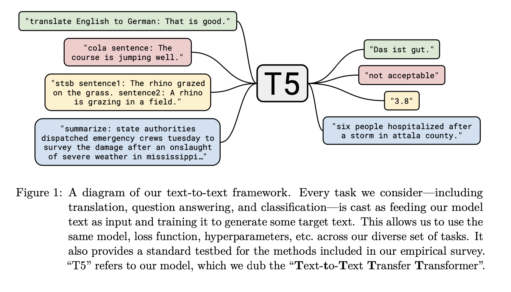

# Everything is text-to-text

 **Text-to-Text Transfer Transformer \(T5\)**는  NLP의 모든 태스크를 Unified framework로 처리하면서도, 모델의 규모를 역대급으로 키우겠다는 사고의 집약체이다. 기존 BERT 모델에서는 모델의 출력이 클래스 레이블이나 입력 범위 내에서만 이루어지기 때문에 generative 하지 못하고 translation, abstractive summarization에는 적용하기 어렵다. 이러한 제약을 없앤 모델인 T5는 입력 및 출력이 항상 텍스트 문자열로 이루어져있다. T5를 통해 machine translation, summarization, question answering, classification 등의 모든 NLP 태스크에 있어서 동일한 모델과 손실함수 및 하이퍼 파라미터를 사용할 수 있다.  

 T5는 Transformer의 encoder-decoder 구조를 기반으로 하며, 동일하게 encoder와 decoder 모두 multi-head self-attention layer와 feed forward network 및 dropout 기법 등을 사용하고 있다. 달라진 점은 input token 부분에서 Transfomer는 sinusoidal, BERT는 position embedding을 사용한 반면 T5는 relative position encoding을 사용했다는 점이다. 즉 입력으로 들어오는 각 token의 위치 별로 동일한 encoding을 주고 attention을 계산하는 것이 아니라, self-attention 계산 시에 offset boundary 내의 token들에게 relative position encoding 값을 부여해주는 것이다. 

 이러한 모델을 NLP의 거의 모든 downstream tasks에 대하여 실험한 결과, SuperGLUE에서 가장 뛰어난 퍼포먼스를 보이며 현재의 SOTA 모델로 자리잡았다. 



