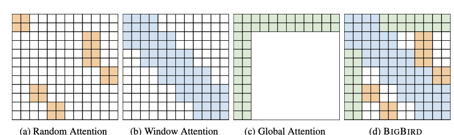

# Improving BERT

 Pre-training 된 모델을 사용해서 transfer learning하는 접근이 많아지고 있지만, 모델 자체가 너무 크기 때문에 제한된 환경에서는 사용하기 어렵다. 따라서 huggingface에서는 기존 BERT의 모델 크기와 연산량을 줄이되 성능은 어느정도 유지할 수 있는 **A distilled version of BERT \(DistilBert\)**를 공개하였다.  실제로 파라미터 개수가 40% 적고, 연산 속도는 60% 빠른 반면,  퍼포먼스는 BERT 성능의 97%를 보여준다. ****Google Research 팀에서 발표한 **A Lite BERT \(ALBERT**\) 또한 기존 BERT 모델에서 파라미터 수를 줄여 같은 구조의 모델에서의 메모리 사용량을 줄이고 학습 속도를 높였다. 





 페이스북 AI 팀에서 발표한 **A Robustly Optimized BERT \(RoBERTa\)**는 BERT보다 성능을 한 단계 업그레이드한 버전이다. 모델 크기가 클수록 성능을 높일 수 있다는 판단 하에 훈련 데이터의 크키와 학습 횟수, 배치 사이즈, 딕셔너리 크기 등을 대폭 늘리는 실험을 하였다. 대신 기존 BERT에서의 NSP 태스크는 학습 효과가 불분명하다고 판단하여 훈련에서 제외하였다. 즉 간과하기 쉬운 부분을 되짚어주며 모델을 제대로 학습하는 방법을 제시하였다. 결과적으로 GLUE, SQuAD, RACE 데이터에 대하여 모두 RoBERTa가 SOTA를 달성하였다.  



 최근에는 MLM 방식에 적응한 BERT가 일부 문장이 비어있지 않은 단어 시퀀스 데이터 훈련에 제대로 적응하지 못한다는 한계가 지적되고 있고, 또한 여러 단어를 동시에 예측할 때 해당 단어 간 상관관계를 고려하지 않는 점도 지적되고 있다. 이런 한계를 극복하고자 등장한 **XLNet**은 앞뒤 문맥을 동시에 고려하는 양방향 언어 모델과 예측 단어 간 상관관계를 고려하는 순방향 모델의 장점을 합쳤다. 

다만 모델이 지나치게 복잡하고, 앞서 언급한 문제가 모델 성능에 미치는 영향에 대한 명확한 근거가 제시되지 않았다는 이유로 업계 내에서는 상대적으로는 덜 사용된다고 한다. 

\(작성중\)



 BERT 모델은 input sequence 길이가 512 tokens으로 제한되어 있다. 2020년 8월 Google Research 팀에서는 이보다 8배 긴 sequence input \(4,096 tokens\)을 다룰 수 있는 **BigBird**를 공개하였다. BigBird는 Transformer 아키턱체를 기반으로 한 모델로, multi-head self-attention과 feed-forward network로 구성된 layer를 여러겹 쌓아서 만든 구조이다. 다만 self-attention 부분에서 full-attention이 아닌 sparse attention으로 연산한다는 점에 차이가 있다. full-attention은 배열 간 모든 조합을 연산하기 때문에 quadratic dependency가 발생할 수 있다. 이러한 연산을 좀 더 linear하게 효율적으로 계산할 수 있도록 BigBird에서는 아래의 세가지\(random, window, global\) 구조가 합쳐진 새로운 attention 방법을 제안하였다. 실제 성능 검증에서도 BigBird의 sparse한 attention이 full attention의 특성을 잃지 않고, long sequence의 입력을 처리하는 데에 있어서 우수한 성능을 보여주었다고 한다. 

* Random attention: 각각의 query가 랜덤한 r개의 key에 attention 한다.
* Window attention: 인접한 token\(or word\)에 영향을 받는다. locality를 강조하여 양 옆으로 일정하게 떨어진 token에 attention 한다. 
* Global attention: global token은 모든 token에 attention 하면서도 모든 token으로부터 attention 받는 token이다. 
* BigBird: 이 세가지 방식을 모두 더한 \(d\)와 같은 형태의 attention이다. 흰색 부분과 같이 빈 부분이 존재하는 sparse한 형태를 띄고 있다. 



