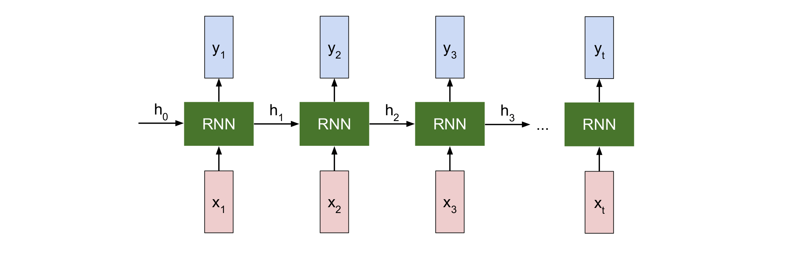
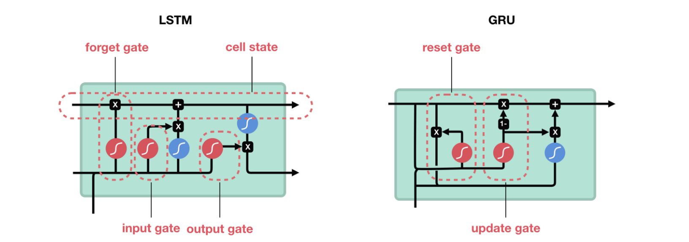

# Sequential models

 1985년에 **Recurrent neural networks \(RNN\)**이 처음 등장하면서, 이를 자연어처리에 적용하기 시작했다. 언어라는 것은 연속적인 시퀀스를 갖고 있기 때문에, 입력의 순서가 중요하게 고려되어야 한다. 하지만 이전의 신경망 모델은 이러한 Sequential data를 처리하지 못했다.  

 기존의 신경망 모델과 달리, RNN은 아래 그림과 같이 이전의 출력값이 다음 상태에 영향을 미친다.  hidden layer의 벡터를 다음 time-step에서 다시 재사용 한다는 특징에 따라 순환\(Recurrent\) 신경망 이라는 이름이 붙게 되었다.     

 하지만 RNN에서는 타겟 단어가 멀리 떨어져 있는 경우에 장기의존성\(Long-term dependency\)의 문제가 나타나 해당 단어를 제대로 학습하지 못한다. 장기의존성 문제란 신경망 모델을 학습할 때 곱해지는 편미분\(partial derivative\) 값이 &lt;1 일 때 기울기가 소실되고, 반면 &gt;1일 때는 기울기가 폭발적으로 증가하는 것을 말한다. 자연어처리에서 긴 문장을 학습하게 될 때 이와 같은 문제가 발생한다.

 따라서 이러한 문제 해결하기 위해 1997년에 **Long Short Term Memory \(LSTM\)**이 등장하였다. 아래의 그림과 같이 cell state와 이를 컨트롤하기 위한 3가지의 게이트\(forget/input/output\)로 구성되어 있어, 기억과 망각이 수학적으로 구현되었다. 

 forget gate는 과거의 정보를 잊을지 말지 결정하는 역할로, 시그모이드를 취해준 값을 내보낸다. 시그모이드 함수의 출력 범위는 0~1 사이기 때문에 그 값이 0이라면 이전 상태의 정보는 완전히 잊고, 1이라면 이전 상태의 정보를 온전히 기억하는 것이다. input gate는 새로운 정보를 cell state에 저장할지를 결정하고,  output gate는 어떤 출력값을 출력할지 결정하는 역할을 한다.  

 이러한 LSTM 구조는 Google Voice, Apple's Siri, Amazon's Alexa, Facebook's automatic translations 등에서 활용되고 있다.

 이어서 LSTM의 구조를 간소화한 모델이 2014년에 등장하게 되는데, 그게 바로 **Gated Recurrent Units \(GRU\)**이다. 여기엔 reset과 update의 두가지 게이트만 사용되었고, 구조가 간소화된 만큼 학습 속도 향상에 크게 기여하였다.  

