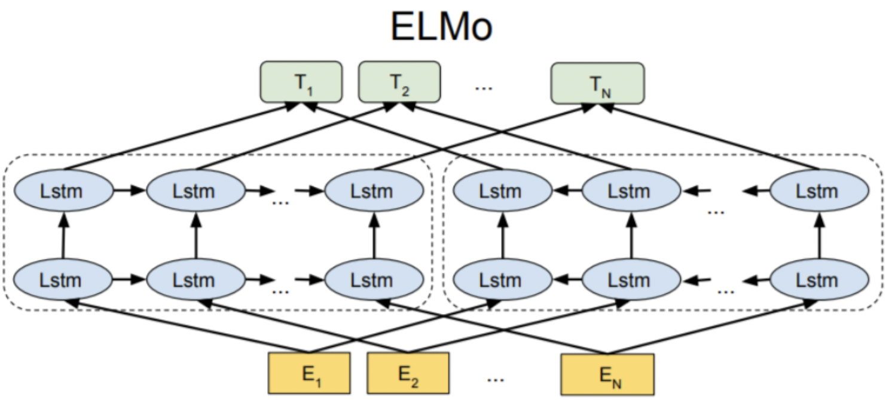

# Word embeddings with context

 **Embeddings from Language Model \(ELMo\)**는 2018년에 등장한 임베딩 방법론이다. 앞서 살펴본 임베딩 방법론 3가지와 달리, ELMo는 주변 문맥에 따라 단어를 임베딩 한다는 특장점을 가지고 있다. 

 예를 들어, 아래의 4개 문장에서 사용된 'date' 라는 단어는 서로 다른 의미를 가지고 있다. 하지만 앞선 임베딩 방법론들에서는 'date'를 모두 동일한 벡터로 임베딩한다. 하지만 ELMo는 이렇게 각 단어마다 고정된 벡터를 주는 것이 아니라 주변 문맥을 고려함으로써 'date'에 대하여 서로 다른 벡터로 임베딩 한다.  

 또한 ELMo의 특징은 사전에 훈련된\(pre-trained\) 언어모델을 사용하여 워드 임베딩을 한다는 점이다. 'pre-trained'에 대한 개념은 이후에 자세히 다뤄진다. 한편 언어 모델이란 시퀀스를 입력으로 받았을 때 출력으로 다음 단어의 예측하는 모델을 말한다. 이러한 언어 모델링에는 RNN\(혹은 LSTM\)을 사용하는데, ELMo는 순방향의 LSTM 뿐만 아니라 역방향의 LSTM도 함께 활용한다. 이렇게 양방향의 모델을 사용하게 되면 단어들 간의 의미적・문법적 관계를 추출하고 맥락을 파악하는 데에 도움이 된다.   

 하지만 안타깝게도 이러한 ELMo는 잠깐의 영화를 누리다가 같은 해에 BERT가 등장하면서 묻혀진다. 

