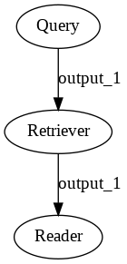
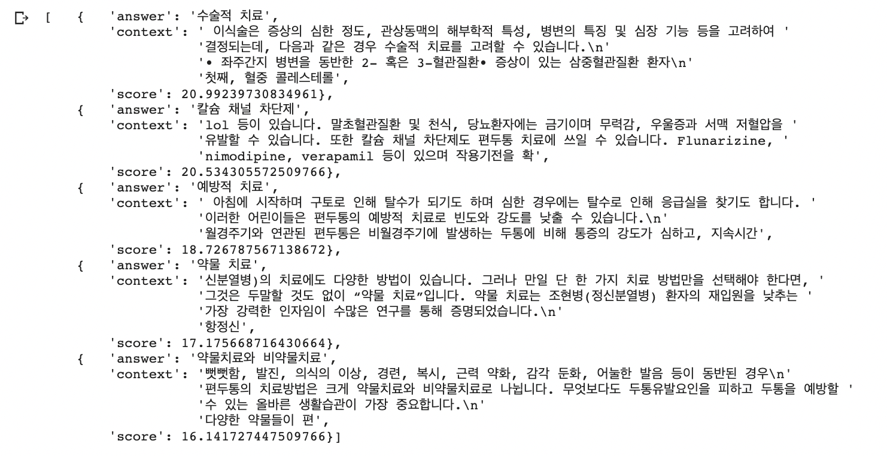
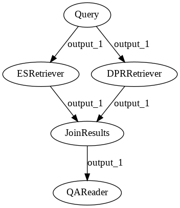
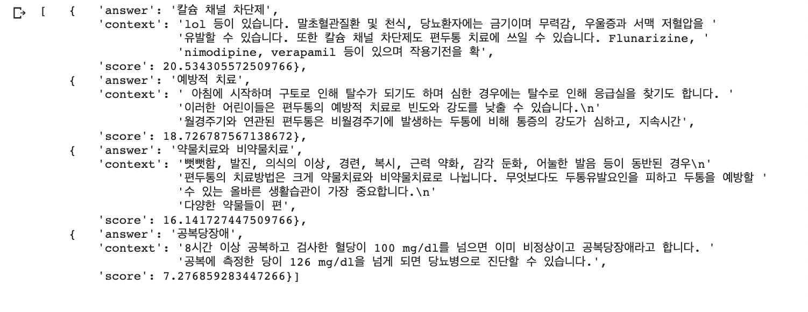

# Build a QA pipeline using Haystack

Ask questions in natural language and find granular answers in documents.

#### **Install haystack**

```python
# Make sure you have a GPU running
!nvidia-smi
```

```python
# Install the latest master of Haystack
!pip install git+https://github.com/deepset-ai/haystack.git
```

#### **Setting up Document Store**

You can think of the DocumentStore as a "database" that:

* stores your texts and meta data
* provides them to the retriever at query time

Haystack finds answers to queries within the documents stored in a `DocumentStore`. There are different DocumentStores in Haystack to fit different use cases and tech stacks. The current implementations of `DocumentStore` include `ElasticsearchDocumentStore`, `FAISSDocumentStore`, `SQLDocumentStore`, and `InMemoryDocumentStore`. [More](https://haystack.deepset.ai/docs/latest/documentstoremd)

You can configure Haystack to work with your existing document stores.

```python
# Start an Elasticsearch server
# You can start Elasticsearch on your local machine instance using Docker. 
# If Docker is not readily available in your environment (eg., in Colab notebooks), then you can manually download and execute Elasticsearch from source.
! wget https://artifacts.elastic.co/downloads/elasticsearch/elasticsearch-7.9.2-linux-x86_64.tar.gz -q
! tar -xzf elasticsearch-7.9.2-linux-x86_64.tar.gz
! chown -R daemon:daemon elasticsearch-7.9.2

import os
from subprocess import Popen, PIPE, STDOUT
es_server = Popen(['elasticsearch-7.9.2/bin/elasticsearch'],
                   stdout=PIPE, stderr=STDOUT,
                   preexec_fn=lambda: os.setuid(1)  # as daemon
                  )

# wait until ES has started
! sleep 30
```

```python
# Connect to Elasticsearch
# Fast & accurate sparse retrieval with many tuning options
# Basic support for dense retrieval

from haystack.document_store import ElasticsearchDocumentStore
document_store = ElasticsearchDocumentStore()
```

#### **Preprocessing of documents**

Haystack provides a customizable pipeline for:

* converting files into texts
* cleaning texts
* splitting texts
* writing them to a Document Store

Data Source: [https://terms.naver.com/list.naver?cid=50871&categoryId=50871](https://terms.naver.com/list.naver?cid=50871&categoryId=50871)

```python
from haystack.preprocessor.cleaning import clean_wiki_text
from haystack.preprocessor.utils import convert_files_to_dicts, fetch_archive_from_http

# Let's first fetch some documents that we want to query
# Here: 102 Encyclopedia contexts for disease

doc_dir = "data/health_txt"
s3_url = "https://raw.githubusercontent.com/Sol-J/study-repository/master/data/health_txt_1.zip"

fetch_archive_from_http(url=s3_url, output_dir=doc_dir)

# Convert files to dicts
dicts = convert_files_to_dicts(dir_path=doc_dir, clean_func=clean_wiki_text, split_paragraphs=True)
```

```python
# Let's have a look at the second entries:
print(dicts[1])
```

```python
# Now, let's write the dicts containing documents to our DB.
document_store.write_documents(dicts)
```

#### **Retriever**

The Retriever is a lightweight filter that can quickly go through the full document store and pass on a set of candidate documents that are relevant to the query. It helps narrowing down the scope for the Reader to smaller units of text where a given question could be answered. There are different Retrievers in Haystack. The current implementations of `Retriever` include `ElasticsearchRetriever`, `TfidfRetriever`, `DensePassageRetriever`, and `EmbeddingRetriever`. [More](https://haystack.deepset.ai/docs/latest/retrievermd)

Retrieval methods can be split into two categories: **Sparse vs Dense**

* Sparse methods, like TF-IDF and BM25, operate by looking for shared keywords between the document and query.
  * simple but effective
  * don’t need to be trained
  * work on any language
* More recently, dense approaches such as Dense Passage Retrieval \(DPR\) have shown even better performance than their sparse counter parts. These methods embed both document and query into a shared embedding space using deep neural networks and the top candidates are the nearest neighbour documents to the query.

  * powerful but computationally more expensive especially during indexing
  * trained using labelled datasets
  * language specific

```python
# The sparse retriever methods(BM25, TF-IDF) are language agnostic. 
from haystack.retriever.sparse import ElasticsearchRetriever
retriever = ElasticsearchRetriever(document_store=document_store)
```

#### **Reader**

A Reader scans the texts returned by retrievers in detail and extracts the k best answers.

In Haystack, you can start using pretrained QA models simply by providing its [HuggingFace Model Hub](https://huggingface.co/models) name to the Reader. The loading of model weights is handled by Haystack, and you have the option of using the QA pipeline from deepset FARM or HuggingFace Transformers.`FARMReader`, `TransformersReader` [More](https://haystack.deepset.ai/docs/latest/readermd)


Haystack Readers contain all the components found in end-to-end open domain QA systems. This includes tokenization, embedding computation, span prediction and candidate aggregation. While the handling of model weights is the same between the FARM and Transformers libraries, their QA pipelines differ in some ways. The major points are:

* The **TransformersReader** will sometimes predict the same span twice while duplicates are removed in the **FARMReader**
* The **FARMReader** currently uses the tokenizers from the HuggingFace Transformers library while the **TransformersReader** uses the tokenizers from the HuggingFace Tokenizers library
* Start and end logits are normalized per passage and multiplied in the **TransformersReader** while they are summed and not normalised in the **FARMReader**

```python
from haystack.reader.farm import FARMReader
reader = FARMReader(model_name_or_path="monologg/koelectra-base-v3-finetuned-korquad", use_gpu=True)
```

#### **Pipeline \(Defalt\)**

With a Haystack `Pipeline` you can stick together your building blocks to a search pipeline. Under the hood, `Pipelines` are Directed Acyclic Graphs \(DAGs\) that you can easily customize for your own use cases. To speed things up, Haystack also comes with a few predefined Pipelines. One of them is the `ExtractiveQAPipeline` that combines a retriever and a reader to answer our questions. You can learn more about `Pipelines` in the [docs](https://haystack.deepset.ai/docs/latest/pipelinesmd).

```python
from haystack.pipeline import ExtractiveQAPipeline
pipe = ExtractiveQAPipeline(reader, retriever)
```

```python
!apt install libgraphviz-dev graphviz
!pip install pygraphviz
```

```python
import pygraphviz
pipe.draw(path="default_retriever.png")
```



```python
# You can configure how many candidates the reader and retriever shall return
# The higher top_k_retriever, the better (but also the slower) your answers. 
prediction = pipe.run(query="편두통 치료는 어떻게 하나요?", top_k_retriever=30, top_k_reader=5)
```

```python
from haystack.utils import print_answers
print_answers(prediction, details="medium")
```



#### **Pipeline \(Multiple retriever\)**

```python
from haystack import Pipeline
from haystack.pipeline import JoinDocuments
from haystack.retriever import DensePassageRetriever
from haystack.retriever.sparse import ElasticsearchRetriever

es_retriever = ElasticsearchRetriever(document_store=document_store)

dpr_retriever = DensePassageRetriever(
    document_store=document_store,
    query_embedding_model="voidful/dpr-question_encoder-bert-base-multilingual",
    passage_embedding_model="voidful/dpr-question_encoder-bert-base-multilingual",
    max_seq_len_query=64,
    max_seq_len_passage=256,
    batch_size=16,
    use_gpu=True,
    embed_title=True,
    use_fast_tokenizers=True
)

document_store.update_embeddings(dpr_retriever)

pipe_2 = Pipeline()
pipe_2.add_node(component=es_retriever, name="ESRetriever", inputs=["Query"])
pipe_2.add_node(component=dpr_retriever, name="DPRRetriever", inputs=["Query"])
pipe_2.add_node(component=JoinDocuments(join_mode="concatenate"), name="JoinResults", inputs=["ESRetriever", "DPRRetriever"])
pipe_2.add_node(component=reader, name="QAReader", inputs=["JoinResults"])
pred = pipe_2.run(query="편두통 치료는 어떻게 하나요?", top_k_retriever=1)
```

```python
pipe_2.draw(path="multiple_retriever.png")
```



```python
print_answers(pred, details="medium")
```



