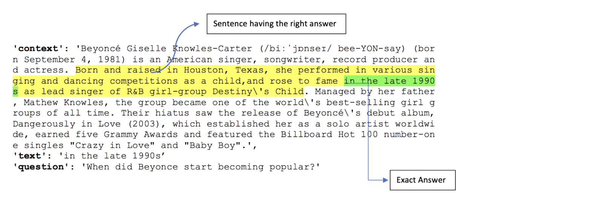

# Open Domain Question Answering \(ODQA\)

Open-domain Question Answering \(ODQA\) is a type of language tasks, asking a model to produce answers to factoid questions in natural language.

**Main difference between Search and QA system**

* Web Search: Finding document list that contain an answer -&gt; Information Retrieval
* Question Answering: Finding an answer in a paragraph or a document -&gt; Machine Reading Comprehension

**Types of questions**

* Factoid type questions \(what, which, when, who, how\)
* List type quesiton \(list of facts or answers\)
* Confirmation questions \(yes or no\)
* Casual question \(why, how\)
* Hypothetical questions \(no specific answers\)
* Complex questions

[A. Chandra Obula Reddy. and Dr. K. Madhavi. \(2017\). A Survey on Types of Question Answering System](http://www.iosrjournals.org/iosr-jce/papers/Vol19-issue6/Version-4/D1906041923.pdf)

**MRC Dataset \(factoid type questions\)**

* Stanford Question Answering Dataset \(SQuAD\) [Link](https://rajpurkar.github.io/SQuAD-explorer/) 
* The Korean Question Answering Dataset \(KorQuAD\) [Link](https://korquad.github.io/)

