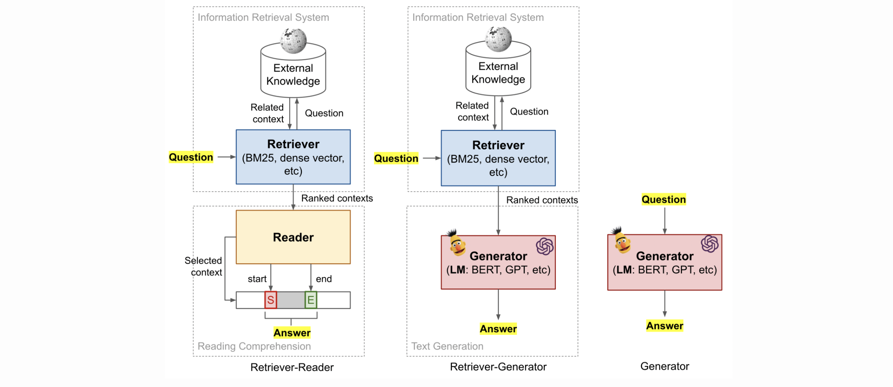

# Overview of the QA frameworks

* Retriever-Reader \(Open-book QA\)
* Retriever-Generator \(Open-book QA\)
* Generator \(Closed-book QA\)

The most common system built with Haystack is the Retriever-Reader Pipeline which is designed to optimize for both speed and performance on the task of Open Domain Question Answering. The ODQA task combines the challenges of document retrieval \(finding the relevant articles\) with that of machine comprehension of text \(identifying the answer span from those articles\).

The **Reader** is the component that performs the closest analysis of the text, with great attention to syntactic and semantic detail, in order to find the span that best satisfies the question or query.

When performing queries in an open domain setting, search can be significantly sped up by first dismissing documents which have no chance of being relevant. This is done through a light-weight document filter known as a **Retriever** which takes all documents as input and returns just as a subset for the Reader to further process.

